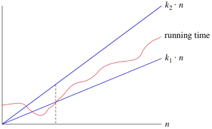

# [칸 아카데미 알고리즘](https://ko.khanacademy.org/computing/computer-science/algorithms) 셀프 스터디
---

### Linear Search
처음부터 하나하나씩 찾는 방법이다.
정확하지만 비효율적.

### Binary Search

바이너리 서치는 정렬된 리스트에서 원하는 아이템을 찾는 효율적인 알고리즘이다.
리스트를 지속적으로 반으로 쪼개서 가능성이 높은 쪽을 찾아가는 방식이다.
가장 빈번하게 사용되는 때 중 하나는 어레이에서 아이템을 찾는 때이다.

### Pseudocode for binary search

인간에게 알고리즘을 설명할때는 아주 상세히 설명을 하지 않아도 될때가 많다.
케익 레시피를 설명할때, 계란은 어떻게 깨는지, 냉장고는 어떻게 여는지 등의 사소한 것은 생략할 수 있다.
사람들은 생략된 맥락을 이해할 수 있지만 컴퓨터를 그렇지 못하다. 그래서 컴퓨터 알고리즘은 자세히 기술해야한다.

하나의 알고리즘을 상세하게 이해해야 프로그래밍 언어로 알고리즘을 구현할 수 있다.
인풋과 아웃풋이 무엇인지, 어떤 변수가 만들어져야 하는지, 초기값은 무엇인지,
결과값을 계산하기 위한 중간단계는 어떠해야 하는지, 이 과정들이 루프로 단순화 될수 있는지 등이다.

Binary Search 알고리즘을 어떻게 기술하는지 보자.
Binary Search의 핵심 아이디어는 합리적인 값의 범위를 유지하는 것이다.
1부터 100까지 숫자를 맞추는 게임을 한다고 가정해보자.
25라고 말했을때 상대가 25보다 높다고 말했고, 81을 말했을때는 81보다 작다고 말했다.
그렇다면 숫자는 26에서 80사이에 있는 것이 합리적이다.

게임이 진행될수록, 숫자를 맞추지 못햇다면 대략적으로 두 부분으로 나눌것이다.
숫자가 틀린 부분의 영역을 버리고 가능성이 높은 쪽을 취하게 된다.

이 숫자 맞추기 게임에서 우리는 몇가지 변수를 사용할 수 있다.
변수 min에는 현재 최소값을 넣고, max에는 현재 최대값을 넣는다.
문제에 대입할 변수는 n으로 두고 가장 가능성 높은 숫자를 넣는다.

Pseudocode로 표현하면 다음과 같다.
1. min = 1, max = n
2. max와 min의 평균값을 구해서 반올림한 후 정수로 만든다.
3. 이 숫자가 맞다면 끝!
4. 숫자가 작다면 min에 숫자를 대입한다.
5. 숫자가 크다면 max에 숫자를 대입한다.
6. 2번으로 돌아간다.
더 자세하게 만들수도 있지만 여기까지.

이것을 자바스크립트 코드로 표현하면 이렇다.

```javascript
/* Returns either the index of the location in the array,
  or -1 if the array did not contain the targetValue */
var doSearch = function(array, targetValue) {
	var min = 0;
	var max = array.length - 1;
    var guess;
    
    while(max >= min){
        guess = Math.floor((max + min) / 2);
        if( array[guess] === targetValue) {return guess;}
        else if(array[guess] < targetValue){ min = guess + 1;}
        else{max = guess - 1;}
    }
    return -1;
};

var primes = [2, 3, 5, 7, 11, 13, 17, 19, 23, 29, 31, 37, 
		41, 43, 47, 53, 59, 61, 67, 71, 73, 79, 83, 89, 97];

var result = doSearch(primes, 73);
println("Found prime at index " + result);

Program.assertEqual(doSearch(primes, 73), 20);
```

횟수를 확인하고 여러 케이스를 확인 하기 위해 코드를 추가해 완성된 코드를 보면 다음과 같다.

```javascript
/* Returns either the index of the location in the array,
  or -1 if the array did not contain the targetValue */
var doSearch = function(array, targetValue) {
	var min = 0;
	var max = array.length - 1;
    var guess;
    var count = 0;
    
    while(max >= min){
        count++;
        guess = Math.floor((max + min) / 2);
        println("guess: " + guess);
        if( array[guess] === targetValue) {
            println("count: " + count);
            return guess;
        }
        else if(array[guess] < targetValue){ min = guess + 1;}
        else{max = guess - 1;}
    }
    return -1;
};

var primes = [2, 3, 5, 7, 11, 13, 17, 19, 23, 29, 31, 37, 
		41, 43, 47, 53, 59, 61, 67, 71, 73, 79, 83, 89, 97];

var result = doSearch(primes, 73);
println("Found prime at index " + result);
var result = doSearch(primes, 11);
println("Found prime at index " + result);
var result = doSearch(primes, 83);
println("Found prime at index " + result);

Program.assertEqual(doSearch(primes, 73), 20);
Program.assertEqual(doSearch(primes, 11), 4);
Program.assertEqual(doSearch(primes, 83), 22);
```

### 이진검색 실행시간
n개의 요소가 있는 배열에서 선형 탐색으로 탐색을 하면 최대 n번의 탐색.
배열의 길이가 증가할수록 이진 탐색이 훨씬 빠르게 탐색 가능.
2를 밑으로 하는 n의 로그: lg n

log2(1580000)=log(1580000)/log(2)

### 점근적 표기법
중요하지 않은 항과 상수 계수를 제거하고 중요한 부분에 집중.
big-Θ, big-O, big-Ω 세 가지가 있다.

### big-Θ 표기법
선형 검색의 간단한 예

```javascript
var doLinearSearch = function(array) {
  for (var guess = 0; guess < array.length; guess++) {
    if (array[guess] === targetValue) { 
        return guess;  // 찾은 경우
    }
  }
  return -1;  // 찾지 못한 경우
};
```
여기서 상수 인자를 안다고 해서 실행시간을 알수는 없다.
배열의 크기에 따라 실행시간이 결정된다.
배열의 크기를 n이라 하면 Θ(n)으로 표기한다.

n의 작은 값에 대해서는 k1*n, k2*n의 실행시간을 어떻게 비교하는지 고려하지않음.
n이 충분히 커지면 실행시간은 반드시 그 사이에 존재.


n^2이나 log n에 대해서도 나타낼 수 있다.


낮은 차수나 시간단위는 고려할 필요가 없다.

big-Θ표기법은 실행 시간에 대해 점근적으로 근접한 한계값이 있다고 표현하는 것.

### 점근적 표기법 형태의 함수
